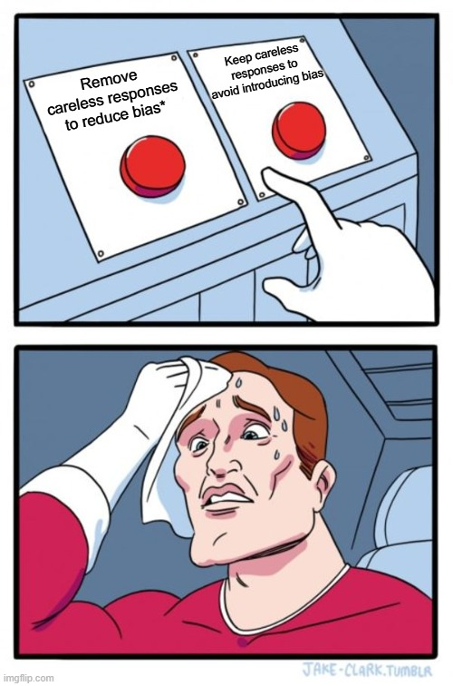

## 서론

도시계획학을 비롯한 사회과학 연구에서는 설문조사를 통해 자료를 수집하는 경우가 많다. 특히, 최근에 온라인 설문이 보편화되면서 접근성 향상, 시간이나 비용의 절약 등으로 인해 설문조사의 활용이 더욱 높아지고 있다.

그러나 조사하는 과정에서 응답자가 성실하게 응답을 제공할 동기가 낮거나, 설문 문항을 잘 이해하지 못하거나 충분히 노력과 주의를 기울이지 않은 문제가 발생할 수 있는데 이러한 경우를 불성실 응답(careless responding)이라고 한다. 문제는 응답자들의 불성실 응답을 잘 통제하지 않으면 측정오차, 제2종 오류 등을 유발시켜서 왜곡된 결과를 도출할 수 있다(Goldammer et al., 2020). 따라서 최근 연구들은 데이터의 질을 향상하기 위해 불성실 응답의 원인과 이를 해결하고자 노력하고 있다.

## 불성실 응답의 주요 원인

일반적으로 불성실 응답은 설문 문항의 내용과 관련 없이 무작위로 응답하는 것, 설문 내용에 빈칸을 남기는 것, 질문을 잘못 이해하는 것, 그리고 질문 내용이 서로 다른 문항들에 대해 의도적으로 동일한 응답을 작성하는 것 등의 유형이 있다. 이러한 불성실 응답의 주요 원인은 크게 2가지로 볼 수 있다.

첫 번째는 개인적 요인 (individual factor), 또는 응답자의 동기 때문에 발생한다는 것이다. 즉 응답자가 조사 내용에 대한 관심이 부족하거나, 연구 목적에 대한 이해 부족하거나, 혹은 다른 업무 처리 때문에 응답 시간이 부족하여 성실하게 응답하려는 내적 동기가 낮은 경우를 말한다. 특히, 응답자가 “만족 응답”에만 급급하여 설문을 빨리 끝내고 싶어 할 때 많이 발생한다. 이외에 성격(꼼꼼하지 않은), 연령(젊은 층), 성별(남성) 등 개인적 특성도 불성실 응답의 주요 원인으로 언급되고 있다.

두 번째 원인은 맥락적 요인 (contextual factor)이라고 하는데, 환경적 요인, 사회적 요인, 구조적 요인으로 나눠진다. 환경적 요인은 환경의 주의 분산이라고도 한다, 주로 설문조사를 수행하는 주변 환경이나 상황 여건이(예를 들어 소음, 우천 등) 좋지 않아서 설문 응답에 집중하기가 쉽지 않은 경우를 의미한다. 사회적 요인은 연구자와의 사회적 접촉을 뜻하는데 주로 조사자와 응답자 간의 상호작용이 부족하거나, 연구의 신뢰성이 낮다고 느낄 때 응답자는 성의 없는 태도를 보일 수 있다. 반면, 적절한 상호 의사소통은 응답자의 적극적인 응답 태도를 보여준다. 마지막으로 구조적 요인은 보통 설문지 길이 또는 설문 문항이 지나치게 방대하거나 복잡해서 응답자는 설문 피로(survey fatigue)를 느껴, 뒷부분으로 갈수록 답변이 기계적이거나 불성실해지는 경향이 있다.

## 분석 프로그램 응용(범인을 찾아라)

최근 오픈 소스인 R의 패키지 careless는 설문조사 데이터에서 응답자가 문항을 제대로 읽지 않고 불성실하게 응답한 케이스를 탐지하는 데 유용한 도구로 활용되고 있음. 연구자들은 주로 Long String, Psychometric Synonym/Antonym, Even-Odd Consistency, Mahalanobis Distance 4개 방을 불성실 응답을 탐지하고 있음.

### Longstring (최장 연속 응답):

한 번호로만 응답한 응답자(Straightlining)를 찾아내는 방법임. 예를 들어, 1번 문항부터 20번 문항까지 모두 '5'로 응답한 경우, 이 응답자는 설문 문항을 제대로 읽지 않고 무작위로 응답했을 가능성이 높다고 판단할 수 있다. Long String 방법은 이러한 패턴을 탐지하여 불성실 응답자를 식별한다.

### Psychometric Synonym / Antonym (심리적 동의어/반의어):

비슷한 질문에는 비슷하게, 반대 질문에는 반대로 답했는지, 즉 '논리적 일관성'을 검증하는 방법임. 예를 들어, "나는 내 삶에 만족한다"와 "나는 내 삶에 불만족한다"라는 두 문항이 있을 때, 응답자가 첫 번째 문항에 '5'로 응답했다면, 두 번째 문항에는 '1'로 응답하는 것이 논리적으로 일관된 답변이 될 것이다. 이 방법은 응답자의 논리적 일관성을 평가하여 불성실 응답을 판단한다.

### Even–Odd Consistency (기우 일관성):

설문지를 반으로 나누었을 때(짝수/홀수) 전체적인 응답 경향이 일치하는지 확인하는 방법임. 예를 들어, 1번, 3번, 5번 문항에 '5'로 응답한 경우, 2번, 4번, 6번 문항에도 '5'로 응답하는 것이 일관된 패턴이 될 것이다. 이 방법은 설문지의 앞부분과 뒷부분에서 응답자의 일관성을 평가하여 불성실 응답을 탐지한다.

### Mahalanobis Distance (마할라노비스 거리):

다른 일반적인 응답자들의 패턴에서 혼자 너무 멀리 떨어져 있는 '통계적 이상치'를 찾아내는 방법임. 예를 들어, 대부분의 응답자가 1번 문항에 '3'으로 응답했지만, 특정 응답자가 '5'로 응답한 경우, 이 응답자는 다른 응답자들과 비교하여 마할라노비스 거리가 멀어질 수 있다. 이 방법은 설문조사 데이터에서 통계적으로 이러한 패턴을 탐지하여 불성실 응답을 식별한다.


```{r setup, include=TRUE}
library(careless)

# Sample Dataset: Simulation study
data1=careless::careless_dataset
data2=careless::careless_dataset2

# 최장 연속 응답
x <- c(4,4,4,3,3,3,3,3,4,4)
print(x)

careless_long <- longstring(data2)
boxplot(careless_long, main = "Boxplot of Longstring index")

# 심리적 동의어/반의어
psychsyn_cor <- psychsyn_critval(data2)
head(psychsyn_cor)

# 기준치를 0.6 이상으로 설정함(연구자들이 합의된 것 아님)
sum(psychsyn_cor$Freq > .60, na.rm = TRUE)

# 히스토그램 그려보기 
example_psychsyn <- psychsyn(data2, critval = .60)
hist(example_psychsyn, main = "Histogram of psychometrical synonyms index")

# 기우 일관성
careless_eo <- evenodd(data2, factors = rep(10,10))
hist(careless_eo, main = "Histogram of even-odd consistency index")

# 마할라노비스 거리
# Q-Q 플롯 보여줌
careless_mahad <- mahad_raw <- mahad(data1)

```


## 그 다음은...?

{width=40% fig-align='center'}


