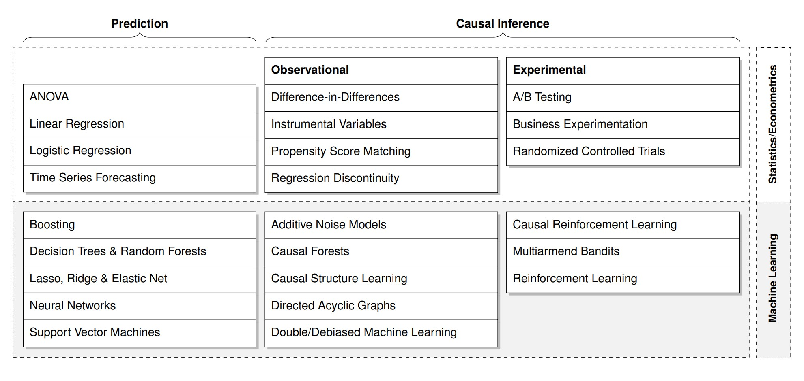
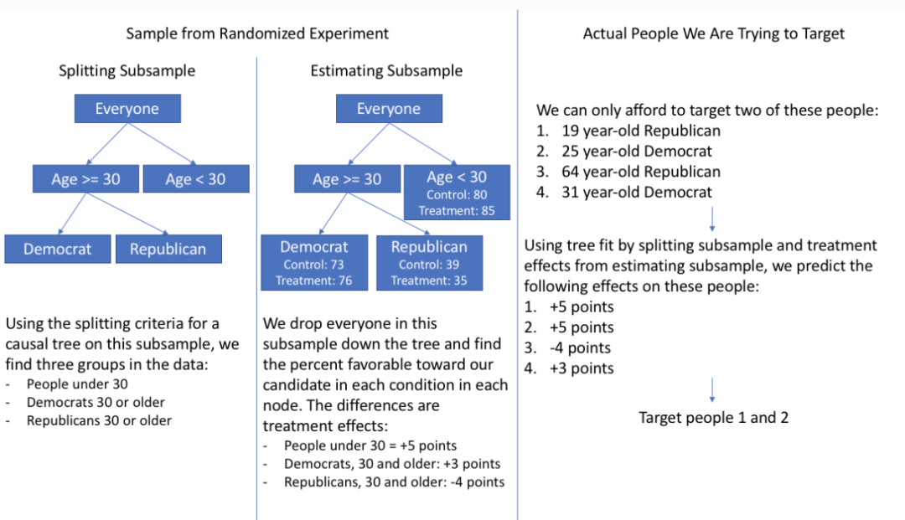

# 1. Introduction

일반적으로 과학적 연구에서는 인과 관계(causal relationship or causation)를 규명하는 데에 관심을 두고 있습니다. 인과 관계란 하나의 사건(cause, 원인)이 다른 사건(effect, 결과)을 일으켰을 때 두 사간 간의 관계를 의미합니다. 따라서 인과 추론(causal inference)[^1]은 원인과 결과 간의 관계를 추론하는 과정입니다.

[^1]: 여기서의 인과추론은 통계적 인과추론(statistical causal inference)을 뜻합니다.

한편, 대부분의 머신러닝은 관측 데이터를 예측(predict)하고 상관관계(correlation)를 파악하는 작업에 훌륭합니다. 그러나 상관관계는 인과관계가 아닙니다(correlation does not imply causation). 즉 사건(또는 변수) A가 사건 B를 예측할 때 유용할 수 있지만 이것이 단순히 A가 B의 원인이 된다고 단정할 수 없습니다. 왜냐하면 우리는 상관관계만으로 A가 B의 원인인지(direct causation), 아니면 B가 A의 원인인지(reverse causation)를 파악하기가 쉽지 않기 때문입니다. 심지어 제3의 경우, A와 B는 인과관계가 존재하지 않고 우연히 상관관계가 있는 것처럼 보이는 spurious correlation일 수도 있습니다.

일예로, 2000년부터 2009년까지 미국 국민 1인당 마요네즈 소비량과 미국 북동부에 있는 메인주의 이혼울 2개 변수가 상당히 높은 상관관계를 부여주고 있습니다[^2]. 그렇다면 사람들이 마요네즈를 많이 먹으면 이혼율이 높아지고 덜 먹으면 이혼율 낮아진다고 말할 수 있을 까요? 그러나 일반상식에 의하면 마요네즈 소비량과 이혼율은 다양한 요인의 영향을 받기 때문에 두 사이에 마치 상관성이 있는 것처럼 보여진다 해도 실제로 인과관계가 있는지를 명확히 설명하기가 어렵습니다. 

[^2]: See [관련 보도기사](https://www.hankyung.com/economy/article/2017011268591)

만약 단순한 예측과 상관관계를 넘어 인관관계까지 파악할 수 있다면 우리는 어떤 사건들의 본질적인 관계를 보다 과학적이고 합리적으로 이해할 수 있을 것입니다.그동안 인과추론은 대부분 임상실험과 정책결정에서 통계분석을 통해 활용되어 왔지만, 빅데이터 시대에 들어서면서 대용량 관측자료가 대폭 증가해서 다양한 연구 분야에서 머신러닝을 기반으로 한 인과추론에 대한 잠재적 응용가치와 수요가 지속적으로 증가하고 있는 추세입니다(see Fig.1). 
특히 머신러닝 방법을 활용한 다양한 인과추론 방법들이 개발되면서, 평균 처치효과(average treatment effect), 조건부 평균 처치효과(conditional average treatment effects)를 등을 추정하고 있습니다. 대표적인 방법으로는 인과 포레스트(causal forests), 베이지안 기법 회귀트리 모형(bayesian additive regression trees model), 표적 최대우도 추정법(targeted maximum likelihood estimation) 등이 있습니다.


이번 글에서는 주로 Stanford University의 Athey[^3] 연구진이 제안한 인과 포레스트에 대해 소개합니다.

[^3]: Susan Athey 교수는 2021년 노벨 경제학상을 수상한 Guido Imbens 교수의 부인입니다.  


Fig.1 Examples of popular data analysis algorithms in statistics and econometrics, as well as
machine learning and artificial intelligence, classified according to prediction and causal inference methods (출처: Hünermund 외 (2022).


# 2. How does causal forests work?
## 2.1 Potential outcome framework

현재 통계적 인과추론을 위한 접근방식은 크게 Judea Pearl의 구조적 인과모형(structural causal model)과 Donald Rubin의 잠재적 결과모형(potential outcome model)으로 구분됩니다. 구조적 인과모형은 전통적 구조방정식 모델(structural equation model)을 방향성 비순환 그래프(directed acyclic graph; DAG)와 결합해서 특정 개입의 효과(또는 처치효과)를 수식화하는 이른바 ‘do-계산법(do-calculus)’입니다. 잠재적 결과모형은 개입여부에 따른 잠재적 결과들(즉 사실-반사실[^4])을 비교해서 처치효과를 추정하는 통계 방법입니다. 

인과추론에 있어서 위의 2가지 접근방식이 모두 중요하지만, 이글에서 소개한 인과 포레스트는 주로 잠재적 결과모형을 기반하고 있습니다. 잠재적 결과모형에서는 개인i에 대해 만약 통제집단과 처치집단에 배정했다면 결과값을 각각 Yi(0), Yi(1)로 나타냅니다. 따라서 전체집단 대상 평균처치효과(average treatment effect, ATE)와 조건부 평균 처치효과(conditional average treatment effect, CATE)는 다음과 같이 정의할 수 있습니다.
$$ATE = E[{Y_i(1)}-{Y_i(0)}]$$
$$CATE = E[{Y_i(1)}-{Y_i(0)}|X_i=x]$$
특히, 우리가 주목해야 할 부분은 CATE가 처치효과의 이질성(treatment effect heterogeneity)에 초점을 두고 개인별로 기대되는 처치효과를 다르게 추정하고 있으며 이른바 맟춤형 정책 수립이 가능해져서 다양한 분야에서 CATE에 대한 활용도가 점점 높아지고 있다는 점입니다. 예를 들어, 동일한 주거복지 지원 프로그램을 참여하더라도 가구특성이나 지역환경 특성에 따라 처치효과가 다르게 나타날 수 있는데 전체 집단에 평균적으로 미치는 처치효과보다는 특정집단의 특성을 고려한 맞춤형 정책이 더 중요해집니다.  

[^4]: 여기서 실현되는(realized) 잠재결과는 사실(factual)이고, 실현되지 않는(unrealized) 잠재결과는 반사실 또는 대안사실(counterfactual)이라고 정의합니다.


## 2.2 Causal forests

인과 포레스트는 ATE뿐만 아니라 CATE까지 모두 추정할 있습니다. 구체적인 추정과정은 다음과 같습니다. 먼저 공변량(covariates) Xi, 처치변수 Wi, 결과변수 Yi로 수집한 데이터(N)를 비복원 추출(without replacement) 방법으로 무작위로 샘플S1(보통 N/2 표본크기로 설정) 샘플S2로 분할합 니다. 이어 샘플S를 다시 무작위로 50%씩 분할(split)해서 샘플 T와 샘플 E로 구성합니다.
다음에 샘플 T의 공변량 Xi와 결과변수 Yi를 대상으로 재귀적 분할(recursive partitioning) 알고리즘을 이용해서 하나의 인과 트리(causal tree)를 만듭니다. 특히 분할 기준(splitting criterion)은 기존 의서결정 트리에서 사용된 outcomes Yi의 평균제곱오차(mean squared error)를 최소화 시키는 것이 아니라 처치효과 간의 차이(treatment effects differ) 또는 분산을 극대화시키는 것입니다.
그리고 샘플 E를 대상으로 인과 트리 모형을 바탕으로 각 잎(leaf) 노드(node)의 모든 개체의 처치효과는 다음과 같이 정의됩니다.
$$ \hat{\tau_i}(x)  = \frac{1}{\left | i: W_i=1,X_i\in L \right | } \sum_{\left | i: W_i=1,X_i\in L \right |}^{}Y_i-\frac{1}{\left | i: W_i=0,X_i\in L \right | } \sum_{\left | i: W_i=0,X_i\in L \right |}^{}Y_i(i\in E) $$
여기서 앞부분은 잎 노드L 중 처치변수W가 1이고 모든 개체의 결과변수Y의 평균 값을 의미하며 뒷부분은 잎 노드L 중 처치변수W가 0이고 모든 개체의 결과변수Y의 평균 값을 나타냅니다. 이렇게 B번을 반복해서 B개의 인과 트리를 얻게 되며 평균처치 효과(ATE)는 다음과 같습니다.
$$ ATE=\frac{1}{B} \sum_{b=1}^{B}\hat{\tau_i,_b}(x)$$

마지막으로 샘플S2과 인과 포레스트를 이용해서 공변량들의 변수중요도를 도출한 다음에 중요도를 기준으로 조건부 평균처치 효과를 계산합니다(Athey and Wager, 2019). 이러한 인과 포레스트의 추정량은 일치성(consistent)을 보여주며 점근적으로 가우스 분포(asymptotically Gaussian)를 따른 것으로 확인되었습니다.

최근 조건부 평균처치 효과에 대한 통계적 검증 등이 RATE(Rank-Weighted Average Treatment Effects) 분석을 통해 확인하는 작업도 논의되고 있습니다. RATE는 어떤 집단에 개입을 했을 때 가장 효과적인지(처치 편의, treatment benefit)를 Targeting Operator Characteristic 분포로 보여주는 도구입니다(Yadlowsky et al., 2021). 




# 3. Usage Examples
## 3.0 페키지 불러오기 
```{r}
library(grf)
```

## 3.1 시뮬레이션 데이터 생선하기
```{r}
n <- 2000
p <- 10
X <- matrix(rnorm(n * p), n, p)
X.test <- matrix(0, 101, p)
X.test[, 1] <- seq(-2, 2, length.out = 101)
W <- rbinom(n, 1, 0.4 + 0.2 * (X[, 1] > 0))
Y <- pmax(X[, 1], 0) * W + X[, 2] + pmin(X[, 3], 0) + rnorm(n)
```

## 3.2 Causal forest를 훈련하기
```{r}
tau.forest <- causal_forest(X, Y, W)
```

## 3.3 ATE 추정(전체 데이터)
```{r}
average_treatment_effect(tau.forest, target.sample = "all")
```

## 3.4 시험 데이터의 HTE(CATE) 신뢰구간(confidence intervals) 추정 
```{r}
tau.forest <- causal_forest(X, Y, W, num.trees = 4000)
tau.hat <- predict(tau.forest, X.test, estimate.variance = TRUE)
sigma.hat <- sqrt(tau.hat$variance.estimates)
plot(X.test[, 1], tau.hat$predictions, 
     ylim = range(tau.hat$predictions + 1.96 * sigma.hat, 
                  tau.hat$predictions - 1.96 * sigma.hat, 0, 2), 
     xlab = "x", ylab = "tau", type = "l")

lines(X.test[, 1], tau.hat$predictions + 1.96 * sigma.hat, col = 1, lty = 2)
lines(X.test[, 1], tau.hat$predictions - 1.96 * sigma.hat, col = 1, lty = 2)
lines(X.test[, 1], pmax(0, X.test[, 1]), col = 2, lty = 1)
```

## 3.5 AUTOC의 95% 신뢰구간 추정
```{r}
train <- sample(1:n, n / 2)
train.forest <- causal_forest(X[train, ], Y[train], W[train])
eval.forest <- causal_forest(X[-train, ], Y[-train], W[-train])
rate <- rank_average_treatment_effect(eval.forest,
        predict(train.forest, X[-train, ])$predictions)
plot(rate)
paste("AUTOC:", round(rate$estimate, 2), "+/", round(1.96 * rate$std.err, 2))
```


# References

-Athey, S., Tibshirani, J., & Wager, S. (2019). Generalized random forests.

-Athey, S., & Wager, S. (2019). Estimating treatment effects with causal forests: An application. Observational studies, 5(2), 37-51.

-Hünermund, P., Kaminski, J., & Schmitt, C. (2022). Causal machine learning and business decision making. Available at SSRN 3867326.

-Yadlowsky, S., Fleming, S., Shah, N., Brunskill, E., & Wager, S. (2021). Evaluating treatment prioritization rules via rank-weighted average treatment effects. arXiv preprint arXiv:2111.07966.

-https://grf-labs.github.io/grf/


