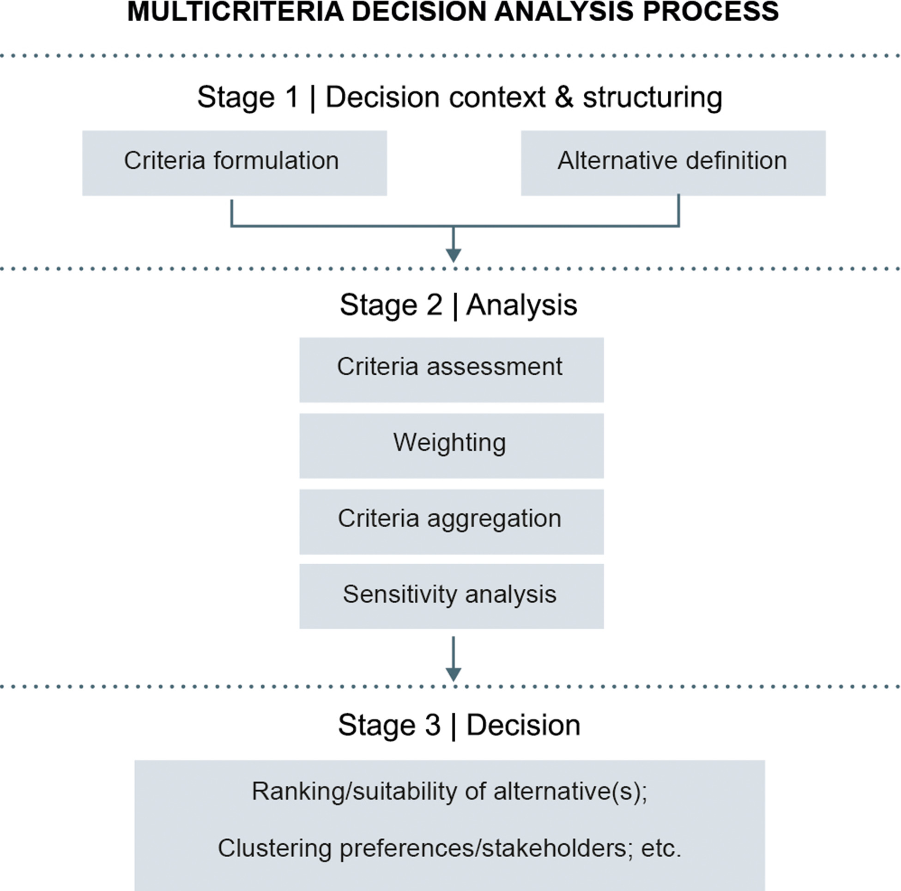
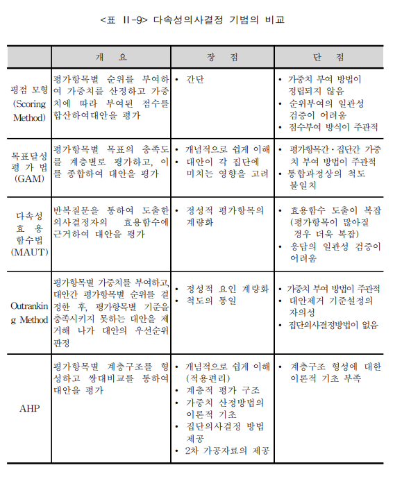

## 서론

도시계획 등 분야에서는 평가 지표체계를 개발하거나 최적의 대안을 도출하는 작업이 점점 중요해지고 있다. 특히 현실 도시문제의 해결은 여러 상충하는 기준을 동시에 고려해야 하는 경우가 많기에, 보다 과학적인 의사결정을 위해 다기준 의사결정(MCDM, Multi-Criteria Decision Making) 방법론이 주로 활용되고 있다. 예컨대, 도시계획에서 대체 교통수단을 평가할 때, 교통 비용, 환경적 영향, 사회적 수용성 등 다양한 기준을 고려하여 최적의 대안을 찾게 된다. 또한, 스마트 시티 사업의 타당성을 평가할 때, 경제적 타당성, 정책적 타당성, 기술적 타당성, 지역균형발전 등 기준을 종합적으로 평가하여 사업 추진 여부를 결정하게 된다. 뿐만 아니라, 다양한 도시 관련 측정 지표를 통합하여 도시쇠퇴나, 회복력 수준을 보다 객관적으로 평가하여 정비사업의 우선순위를 도출하게 된다.

일반적으로 MCDM 분석과정은 대체로 다음과 같은 단계로 이루어진다. 첫째, 문제 정의 단계에서는 의사결정 문제의 맥락과 목적을 명확히 하고, 관련된 이해관계자들을 식별한다. 둘째, 기준 및 대안 선정 단계에서는 의사결정에 영향을 미치는 주요 기준과 가능한 대안들을 도출한다. 셋째, 데이터 수집 및 평가 단계에서는 각 대안이 각 기준에 대해 어떻게 평가되는지를 분석한다. 넷째, 가중치 부여 단계에서는 각 기준의 상대적 중요도를 결정하여 가중치를 부여한다. 다섯째, 대안 평가 및 우선순위 결정 단계에서는 선택된 MCDM 기법을 적용하여 각 대안의 종합 점수를 계산하고, 이를 바탕으로 대안들의 우선순위를 결정한다. 마지막으로, 결과 해석 및 의사결정 단계에서는 분석 결과를 해석하여 최적의 대안을 선택하고, 이를 실행하기 위한 전략을 수립한다.


Fig.1 MCDM의 주요 분석과정 (출처: Adem Esmail and Geneletti, 2018).


## MCDM의 유형 및 주요 기법

MCDM에 대한 연구는 이미 오랜 전부터 꾸준히 진행되어 왔는데, 고려하는 기준이 속성(Attribute) 차원인지, 목적(Objective) 차원인지에 따라 크게 두 가지로 구분된다. 첫 번째는 다속성 의사결정(MADM)으로, 대안이 고정되어 있고, 각 대안이 여러 속성에 대해 평가되는 경우에 적용된다. 예를 들어, 여러 교통수단을 평가할 때, 각 교통수단이 비용, 환경 영향, 사회적 수용성 등의 속성에 대해 평가되는 경우가 이에 해당한다. 두 번째는 다목적 의사결정(MODM)으로, 대안이 고정되어 있지 않고, 여러 목적을 동시에 최적화하려는 경우에 적용된다. 예를 들어, 도시계획에서 경제적 타당성, 정책적 타당성, 기술적 타당성 등을 동시에 고려하여 최적의 사업 추진 방안을 찾는 경우가 이에 해당한다. 

이들의 차이점은 MADM은 미리 정해진 유한개(discrete)의 대안들 사이의 우선순위를 결정하는 과정을 강조하는 반면, MODM은 정해지지 않은 무한개 또는 연속적(continuous)의 대안 중에서 최적의 대안을 선정하는 과정을 중요시한다는 것이다. 다시말해 전자는 "정해진 것들 중 무엇이 더 나은가"를 찾는 것이며, 후자는 "가능한 모든 경우 중 가장 좋은 것은 무엇인가"를 찾는 방식의 차이이다. 한편, 실증적 연구에서는 이 둘이 혼용되어 사용되는 경우가 많다. 예를 들어, 도시계획에서 대체 교통수단을 평가할 때, 여러 교통수단이라는 유한개의 대안이 존재하지만, 각 대안이 여러 속성에 대해 평가되는 경우가 많기 때문에 MADM과 MODM이 동시에 적용되는 경우가 많다. 

다만, MODM은 대안을 무한 개로 가정하고 주어진 목표들과의 편차를 최소화하는 대안을 찾아내는 것이지만, 대부분의 연구에서는 여러 가지 제약 조건 때문에 유한의 대안들 중에서는 우선순위나 선호를 가장 잘 반영하는 대안을 찾아내는 것에 더 많은 관심을 두고 있다. 따라서 이 글에서는 MODM 대신 보다 일반적인 MADM에 초점을 맞추고, AHP(Analytic Hierarchy Process), CV(Coefficient of Variation), PCA(Principal Component Analysis), Entropy Method, CRITIC(Criteria Importance Through Intercriteria Correlation), TOPSIS(Technique for Order of Preference by Similarity to Ideal Solution) 등을 중심으로 MCDM 기법들을 설명하겠다.

### AHP
AHP는 주관적 기법으로 계층적 구조로 문제를 분석하여 대안의 우선순위를 결정하는 방법으로, 전문가의 판단을 기반으로 하는 쌍대비교(pairwise comparison)를 통해 각 기준과 대안의 상대적 중요도를 평가한다. 

### CV
CV는 각 속성의 변동성을 측정하여 중요도를 결정하는 방법으로, 변동성이 큰 속성이 더 중요한 것으로 간주된다. 즉 더 큰 가중치를 부여한다.

### PCA
PCA는 다수의 속성을 소수의 주성분으로 축소하여 데이터의 구조를 파악하는 방법으로, 주성분의 분산을 통해 각 속성의 중요도를 평가한다. 

### Entropy Method
Entropy Method는 정보 이론에 기반하여 각 속성의 불확실성(entropy)을 측정하여 중요도를 결정하는 방법으로, 불확실성이 낮은 속성이 더 중요한 것으로 간주하여 더 큰 가중치를 부여한다.

### CRITIC
CRITIC은 각 속성 간의 상관관계를 고려하여 중요도를 결정하는 방법으로, 상관관계가 낮은 속성이 더 중요한 것으로 간주된다. 

### TOPSIS
TOPSIS는 이상적인 대안과 최악의 대안에 대한 거리를 계산하여 대안의 우선순위를 결정하는 방법으로, 이상적인 대안에 가까운 대안이 더 좋은 것으로 간주된다.

각 다기준분석 방법들의 장단점 등을 정리하여 비교하면 다음과 같다.

Fig.2 다기준분석 방법들의 장단점 비교.


## 분석 프로그램 응용

이글에서는 주로 R의 패키지인 RMCDA를 활용하여 다기준 의사결정을 분석하고자 한다. RMCDA는 다양한 MCDM 기법들을 구현한 패키지로, AHP, CV, PCA, Entropy Method, CRITIC, TOPSIS 등 여러 방법을 지원한다. 

또한, RMCDA는 사용자 친화적인 인터페이스와 다양한 시각화 도구를 제공하여 분석 결과를 쉽게 해석할 수 있도록 돕는다. 예를 들어, AHP 분석을 수행할 때, RMCDA는 계층적 구조를 시각적으로 표현하고, 각 기준과 대안의 상대적 중요도를 그래프로 나타내어 분석 결과를 직관적으로 이해할 수 있도록 한다. 또한, TOPSIS 분석에서는 이상적인 대안과 최악의 대안에 대한 거리를 시각적으로 표현하여 대안들의 우선순위를 명확하게 보여준다. 이러한 기능들은 RMCDA가 다기준 의사결정 분석에 매우 유용한 도구임을 보여준다.

### AHP 분석:

한 번호로만 응답한 응답자(Straightlining)를 찾아내는 방법임. 예를 들어, 1번 문항부터 20번 문항까지 모두 '5'로 응답한 경우, 이 응답자는 설문 문항을 제대로 읽지 않고 무작위로 응답했을 가능성이 높다고 판단할 수 있다. Long String 방법은 이러한 패턴을 탐지하여 불성실 응답자를 식별한다.

### Psychometric Synonym / Antonym (심리적 동의어/반의어):

비슷한 질문에는 비슷하게, 반대 질문에는 반대로 답했는지, 즉 '논리적 일관성'을 검증하는 방법임. 예를 들어, "나는 내 삶에 만족한다"와 "나는 내 삶에 불만족한다"라는 두 문항이 있을 때, 응답자가 첫 번째 문항에 '5'로 응답했다면, 두 번째 문항에는 '1'로 응답하는 것이 논리적으로 일관된 답변이 될 것이다. 이 방법은 응답자의 논리적 일관성을 평가하여 불성실 응답을 판단한다.

### Even–Odd Consistency (기우 일관성):

설문지를 반으로 나누었을 때(짝수/홀수) 전체적인 응답 경향이 일치하는지 확인하는 방법임. 예를 들어, 1번, 3번, 5번 문항에 '5'로 응답한 경우, 2번, 4번, 6번 문항에도 '5'로 응답하는 것이 일관된 패턴이 될 것이다. 이 방법은 설문지의 앞부분과 뒷부분에서 응답자의 일관성을 평가하여 불성실 응답을 탐지한다.

### Mahalanobis Distance (마할라노비스 거리):

다른 일반적인 응답자들의 패턴에서 혼자 너무 멀리 떨어져 있는 '통계적 이상치'를 찾아내는 방법임. 예를 들어, 대부분의 응답자가 1번 문항에 '3'으로 응답했지만, 특정 응답자가 '5'로 응답한 경우, 이 응답자는 다른 응답자들과 비교하여 마할라노비스 거리가 멀어질 수 있다. 이 방법은 설문조사 데이터에서 통계적으로 이러한 패턴을 탐지하여 불성실 응답을 식별한다.


```{r setup, include=TRUE}
library(careless)

# Sample Dataset: Simulation study
data1=careless::careless_dataset
data2=careless::careless_dataset2

# 최장 연속 응답
x <- c(4,4,4,3,3,3,3,3,4,4) 
print(x) # 여기서 5번 "3"라는 문항을 연속적으로 응답하여 의심할 수 있음

# 좀더 구체적인 데이터를 활용하여 박스플롯 사용하기
# 결과를 보면 상당수의 이상치(의심되는 불성실한 응답)를 확인할 수 있음
careless_long <- longstring(data2)
boxplot(careless_long, main = "Boxplot of Longstring index")

# 심리적 동의어/반의어
psychsyn_cor <- psychsyn_critval(data2)
head(psychsyn_cor)

# 기준치를 0.6 이상으로 설정함(연구자들이 합의된 것 아님)
sum(psychsyn_cor$Freq > .60, na.rm = TRUE)

# 히스토그램 그려보기 
example_psychsyn <- psychsyn(data2, critval = .60)
hist(example_psychsyn, main = "Histogram of psychometrical synonyms index")

# 기우 일관성
careless_eo <- evenodd(data2, factors = rep(10,10))
hist(careless_eo, main = "Histogram of even-odd consistency index")

# 마할라노비스 거리
# Q-Q 플롯 보여줌
careless_mahad <- mahad_raw <- mahad(data1)

```


## 그 다음은...?

{width=40% fig-align='center'}


